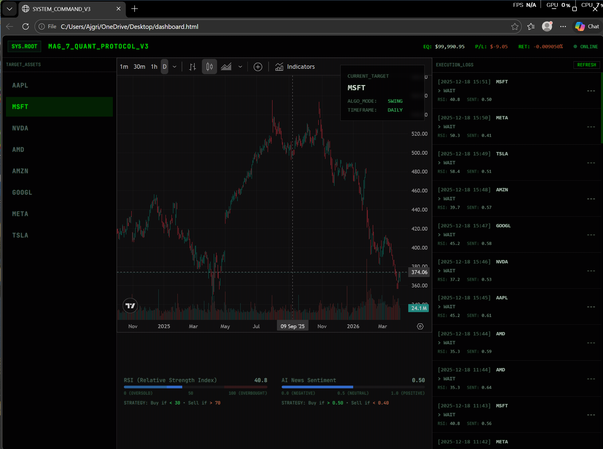

# Tradingbot-system-n8n
Automated algorithmic trading system monitoring the Magnificent 7 stocks + AMD , featuring AI sentiment analysis and a custom frontend dashboard.

# MAG 7 + AMD Trading System

An automated algorithmic trading protocol designed to monitor the "Magnificent 7" stocks (plus AMD). This system integrates technical indicators (RSI) with AI-driven news sentiment analysis to execute paper trades, served to a custom frontend dashboard via a custom API.

## 🏗️ System Architecture
This project is built using a microservice architecture, broken down into three core backend workflows (built on n8n) and a frontend dashboard.

### 1. The Trading Engine (`trader bot mag 7 + amd (1).json`)
The core logic engine running on a cron-schedule.
* **Data Ingestion:** Pulls daily RSI data from **AlphaVantage** and 48-hour news headlines from **NewsAPI**.
* **AI Sentiment Analysis:** Passes headlines to **Google Gemini 2.5 Flash** to generate a normalised sentiment score (0.0 to 1.0).
* **Execution:** Evaluates custom conditions (e.g., RSI < 30 AND Sentiment > 0.50). Executes paper trades via the **Alpaca Trading API**.
* **Logging:** Records all actions (Buys, Sells, Waits) to a Google Sheet database.

### 2. Dashboard Data API (`Dashboard Data API (1).json`)
A Backend-For-Frontend (BFF) webhook service.
* Intercepts `GET` requests from the frontend dashboard.
* Fetches live equity and P/L data from Alpaca.
* Fetches the latest trading logs from the Google Sheets database.
* Merges and returns a filtered JSON payload to the frontend.

### 3. Daily Trade Briefing (`Daily Trade Briefing.json`)
An automated reporting system.
* Triggers after the market closes.
* Pulls the day's trading logs and formats them for AI context.
* Uses **Perplexity AI (Sonar model)** to search the live web and generates a summary explaining *why* certain stocks had specific sentiment scores that day.
* Emails the formatted HTML briefing via Gmail.

### 4. Frontend Terminal (`dashboard.html`)
A custom-built HTML/JS interface.
* Uses `fetch()` to call the local n8n Data API.
* Integrates the **TradingView** widget for live charting.
* Displays dynamic execution logs, live P/L, and AI sentiment vs. RSI scores.

## 🛠️ Tech Stack
* **Backend & Automation:** n8n
* **Frontend:** HTML, CSS, JavaScript
* **AI Models:** Gemini 2.5 Flash, Perplexity (Sonar)
* **APIs:** Alpaca, AlphaVantage, NewsAPI

## 🤖 AI-Assisted Development
The backend architecture, API integrations, and n8n automation flows of this project were designed and built by me. However, my focus on this is primarily on backend automation rather than frontend web development, I utilised AI to generate the HTML, CSS, and structural layout of the `dashboard.html` interface based on my design specifications. This allowed me to rapidly prototype a functional UI while dedicating my time to the core logic.
